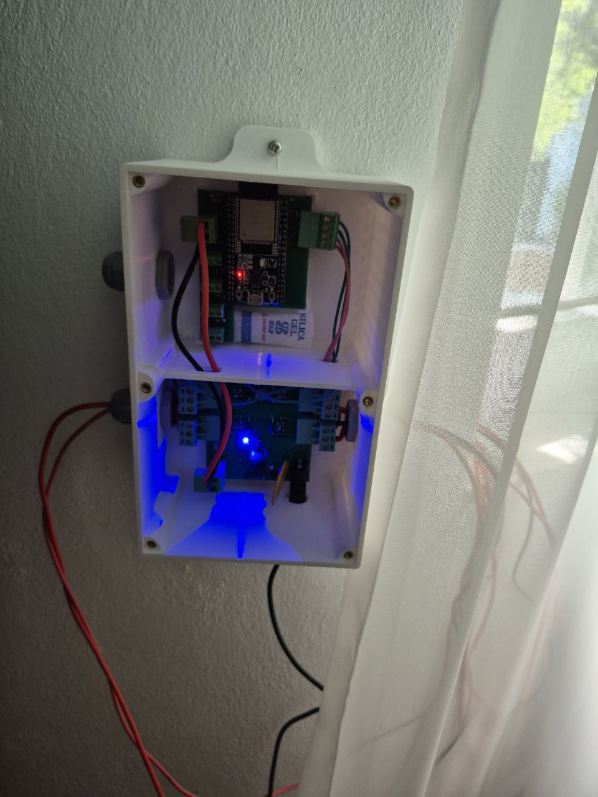

# AGW — Smart Garden Watering System

> An ESP32-based smart garden watering system with custom PCBs and a web application for controlling and monitoring plant watering.

[](https://isocpp.org/)
[](https://www.python.org/)
[](https://developer.mozilla.org/en-US/docs/Web/JavaScript)
[](https://developer.mozilla.org/en-US/docs/Web/HTML)
[](https://developer.mozilla.org/en-US/docs/Web/CSS)
[](https://flask.palletsprojects.com/)
[](https://platformio.org/)
[](https://www.espressif.com/)

<table>
  <tr>
    <td></td>
    <td></td>
    <td></td>
  </tr>
</table>

## Demo

[Watch the AGW demonstration video](docs/video/demo.mp4)

## Overview

AGW is a smart garden watering system designed to automate plant watering while allowing the user to monitor and control the system through a web application.

The system combines custom-designed PCBs, an ESP32 controller, water pumps, and a web-based interface into a single system.

## Features

- ESP32-based controller
- Custom PCBs
- Automatic plant watering
- Web-based control and monitoring
- Multiple water pumps
- Web application built with Flask
- Firmware developed with PlatformIO

## System Architecture

AGW consists of an ESP32 controller, two custom PCBs, a Flask backend, and a web application.

### Overall System

```text
┌─────────────────┐
│ Web Application │
└────────┬────────┘
         │
         ▼
┌─────────────────┐
│  Flask Backend  │
└────────┬────────┘
         │
         │ Wi-Fi / HTTP
         ▼
      ┌───────┐
      │ ESP32 │
      └───┬───┘
          │
     ┌────┴─────┐
     │          │
     ▼          ▼
  Sensors     Pumps
```

### Soil-Moisture Data Flow

```text
┌─────────────────────┐
│ Soil-Moisture       │
│ Sensors              │
└──────────┬──────────┘
           │ Sensor Data
           ▼
┌─────────────────────┐
│ Logic PCB            │
└──────────┬──────────┘
           │
           ▼
        ┌───────┐
        │ ESP32 │
        └───┬───┘
            │
            │ Wi-Fi / HTTP
            ▼
┌─────────────────────┐
│ Flask Backend        │
└──────────┬──────────┘
           │
           ▼
┌─────────────────────┐
│ Web Application      │
└─────────────────────┘
```

### Pump Control

```text
┌───────┐
│ ESP32 │
└───┬───┘
    │
    ▼
┌─────────────────────┐
│ Logic PCB            │
└──────────┬──────────┘
           │ MOSFET
           │ Control Signals
           ▼
┌─────────────────────┐
│ Power PCB            │
│ MOSFET Switching     │
└──────────┬──────────┘
           │
           ▼
     ┌───────────┐
     │   Pumps   │
     └───────────┘
```

## Hardware

AGW is built around an ESP32 controller and two custom-designed PCBs: a logic board and a power board.

### Logic PCB

The logic PCB handles the low-power control and sensing side of the system. It interfaces with the ESP32, reads the soil-moisture sensors, and provides control signals for the pump switching circuitry.

### Power PCB

The power PCB handles the pump power side of the system. MOSFETs on the board switch the negative side of the pump circuits based on control signals received from the logic PCB.

### Main Components

- ESP32
- Custom logic PCB
- Custom power PCB
- Water pumps
- Soil-moisture sensors
- 12 V power supply

## Software

### ESP32 Firmware

The ESP32 firmware is developed in C++ using PlatformIO. It handles sensor data acquisition, pump control, communication with the backend, and authentication.

The ESP32 authenticates with the backend using token-based authentication before sending system data and receiving control instructions.

### Web Application

The web application is built with Python and Flask. It provides the interface for monitoring the garden and controlling the watering system.

The backend includes its own login and authentication system for users accessing the web application.

The frontend uses HTML, CSS, and JavaScript. It was deliberately designed to represent the physical garden from a top-down view, allowing users to interact with the watering system in a way that corresponds to the layout of the actual garden.

This design was chosen with ease of use in mind, particularly for users who may not be comfortable with conventional technical dashboards. The goal was to make the system intuitive enough for our grandparents to use without needing to understand the underlying technology.

## Repository Structure

```text
AGW-GitHub/
├── AGW/                    # ESP32 firmware
│   ├── include/
│   ├── src/
│   ├── test/
│   └── platformio.ini
│
├── AGW_web/                # Flask web application
│   ├── static/
│   ├── templates/
│   ├── main.py
│   └── requirements.txt
│
├── docs/
│   ├── images/             # Project images
│   └── video/              # Demonstration video
│
├── README.md
└── .gitignore
```

## Security & Configuration

Credentials, authentication secrets, local configuration files, and generated databases are intentionally excluded from the repository.

Before running the system, the required configuration files must be created locally according to the deployment environment.

## Project Status

The core AGW system is functional, including the ESP32 firmware, custom PCBs, pump control, backend, and web application.

The system has been tested locally, with the web application communicating with the ESP32 through the Flask backend to monitor and control the watering system.

Soil-moisture sensing hardware and firmware support have been prepared, but the sensors were not installed in the final prototype because sufficiently long cables were not available due to a sharp increase in cable prices.

The system is currently being prepared for remote deployment so that it can eventually be accessed outside the local network.