# AGW — Smart Garden Watering System

> An ESP32-based smart garden watering system with custom PCBs and a web application for controlling and monitoring plant watering.

[](https://isocpp.org/)
[](https://www.python.org/)
[](https://developer.mozilla.org/en-US/docs/Web/JavaScript)
[](https://developer.mozilla.org/en-US/docs/Web/HTML)
[](https://developer.mozilla.org/en-US/docs/Web/CSS)
[](https://flask.palletsprojects.com/)
[](https://platformio.org/)
[](https://www.espressif.com/)

<table>
  <tr>
    <td></td>
    <td></td>
    <td></td>
  </tr>
</table>

## Demo

[Watch the AGW demonstration video](docs/video/demo.mp4)

## Overview

AGW is a smart garden watering system designed to automate plant watering while allowing the user to monitor and control the system through a web application.

The system combines custom-designed PCBs, an ESP32 controller, water pumps, and a web-based interface into a single system.

## Features

- ESP32-based controller
- Custom PCBs
- Automatic plant watering
- Web-based control and monitoring
- Multiple water pumps
- Web application built with Flask
- Firmware developed with PlatformIO

## Engineering Highlights

- Custom-designed logic and power PCBs
- ESP32-based embedded controller
- Sensor data acquisition and pump control
- Token-based ESP32 ↔ backend authentication
- Flask-based web application
- Custom SolidWorks enclosure
- 3D-printed hardware enclosure
- Breadboard → perfboard → custom PCB development process
- Deployed and tested in a real garden environment

## System Architecture

AGW consists of an ESP32 controller, two custom PCBs, a Flask backend, and a web application.

### Overall System

```text
┌─────────────────┐
│ Web Application │
└────────┬────────┘
         │
         ▼
┌─────────────────┐
│  Flask Backend  │
└────────┬────────┘
         │
         │ Wi-Fi / HTTP
         ▼
      ┌───────┐
      │ ESP32 │
      └───┬───┘
          │
     ┌────┴─────┐
     │          │
     ▼          ▼
  Sensors     Pumps
```

### Soil-Moisture Data Flow

```text
┌─────────────────────┐
│ Soil-Moisture       │
│ Sensors              │
└──────────┬──────────┘
           │ Sensor Data
           ▼
┌─────────────────────┐
│ Logic PCB            │
└──────────┬──────────┘
           │
           ▼
        ┌───────┐
        │ ESP32 │
        └───┬───┘
            │
            │ Wi-Fi / HTTP
            ▼
┌─────────────────────┐
│ Flask Backend        │
└──────────┬──────────┘
           │
           ▼
┌─────────────────────┐
│ Web Application      │
└─────────────────────┘
```

### Pump Control

```text
┌───────┐
│ ESP32 │
└───┬───┘
    │
    ▼
┌─────────────────────┐
│ Logic PCB            │
└──────────┬──────────┘
           │ MOSFET
           │ Control Signals
           ▼
┌─────────────────────┐
│ Power PCB            │
│ MOSFET Switching     │
└──────────┬──────────┘
           │
           ▼
     ┌───────────┐
     │   Pumps   │
     └───────────┘
```

## Hardware

AGW is built around an ESP32 controller and two custom-designed PCBs: a logic board and a power board.

### Logic PCB

The logic PCB handles the low-power control and sensing side of the system. It interfaces with the ESP32, reads the soil-moisture sensors, and provides control signals for the pump switching circuitry.

### Power PCB

The power PCB handles the pump power side of the system. MOSFETs on the board switch the negative side of the pump circuits based on control signals received from the logic PCB.

### Main Components

- ESP32
- Custom logic PCB
- Custom power PCB
- Water pumps
- Soil-moisture sensors
- 12 V power supply

## Software

### ESP32 Firmware

The ESP32 firmware is developed in C++ using PlatformIO. It handles sensor data acquisition, pump control, communication with the backend, and authentication.

The ESP32 authenticates with the backend using token-based authentication before sending system data and receiving control instructions.

### Web Application

The web application is built with Python and Flask. It provides the interface for monitoring the garden and controlling the watering system.

The backend includes its own login and authentication system for users accessing the web application.

The frontend uses HTML, CSS, and JavaScript. It was deliberately designed to represent the physical garden from a top-down view, allowing users to interact with the watering system in a way that corresponds to the layout of the actual garden.

This design was chosen with ease of use in mind, particularly for users who may not be comfortable with conventional technical dashboards. The goal was to make the system intuitive enough for our grandparents to use without needing to understand the underlying technology.

The following screenshots show the web application's authentication interface and garden control dashboard.

<p align="center">
  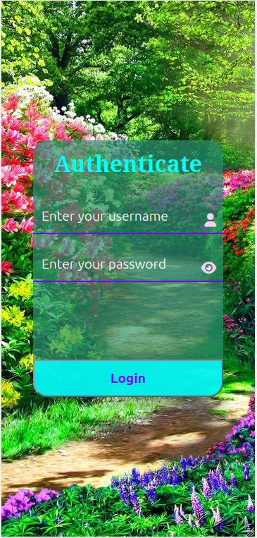
  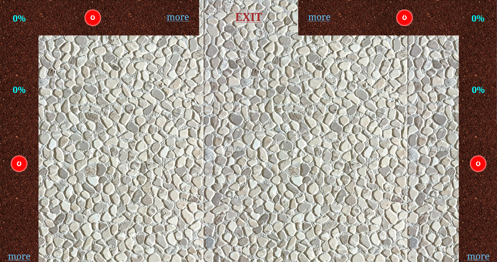
  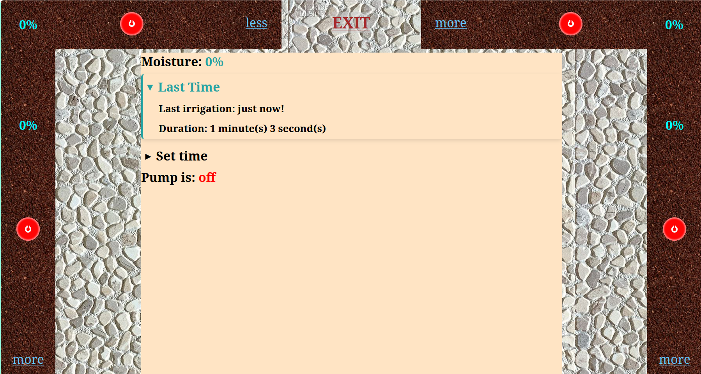
</p>

## Hardware Development

### Breadboard Prototype

<p align="center">
  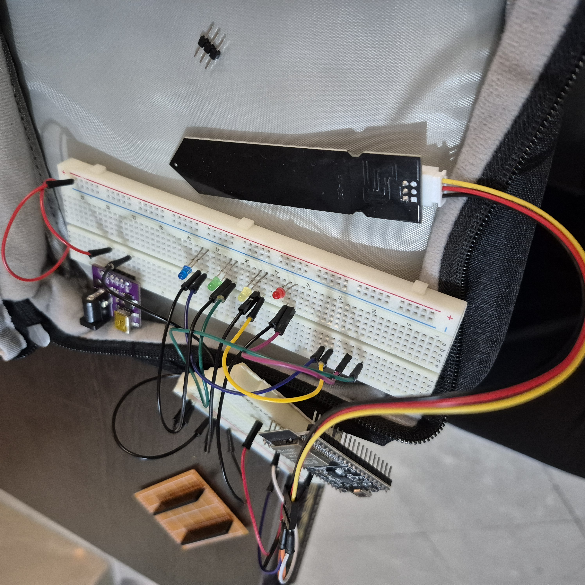
</p>

The initial prototype was built on a breadboard to verify communication between the ESP32 and the backend. At this stage, the pumps had not yet been purchased, so LEDs were used to simulate the pump outputs and verify that control requests were correctly received and acted upon by the ESP32.

### Perfboard Prototype

<p align="center">
  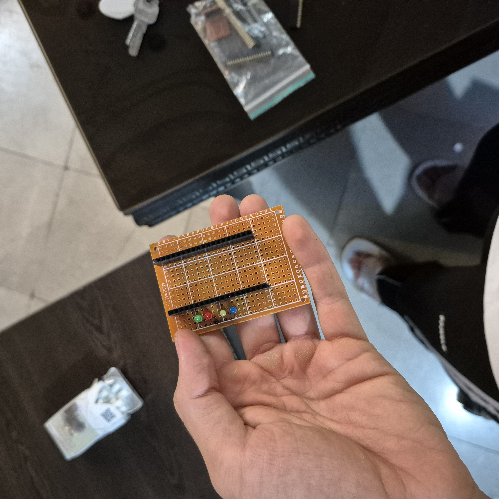
  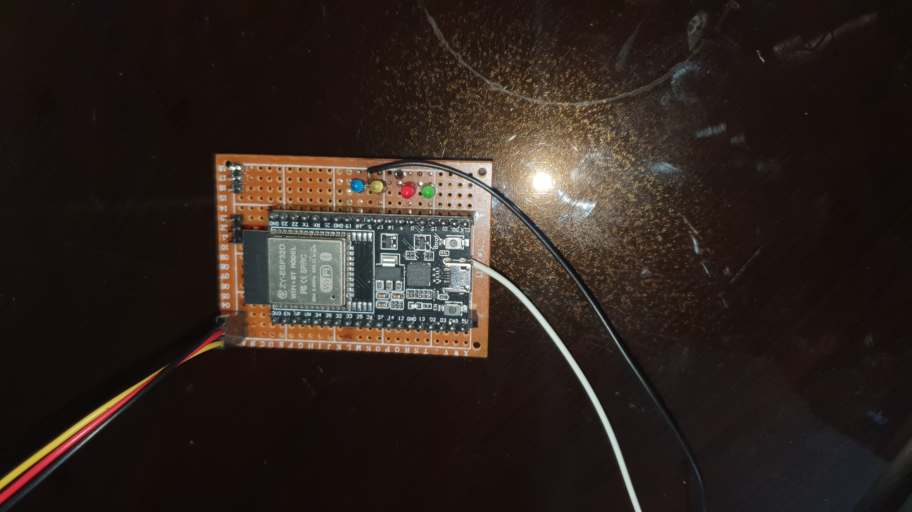
</p>

After the initial communication and control tests, the system was transferred to perfboard for a more permanent hardware prototype.

The ESP32 was mounted using a socket/header arrangement rather than being soldered directly to the board, allowing the controller to be removed without desoldering it.

<p align="center">
  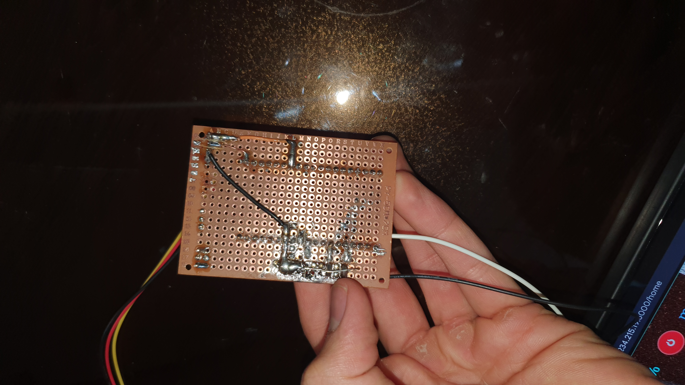
</p>

The underside of the prototype shows the soldered connections and wiring used to assemble the circuit.

### Power Prototype

<p align="center">
  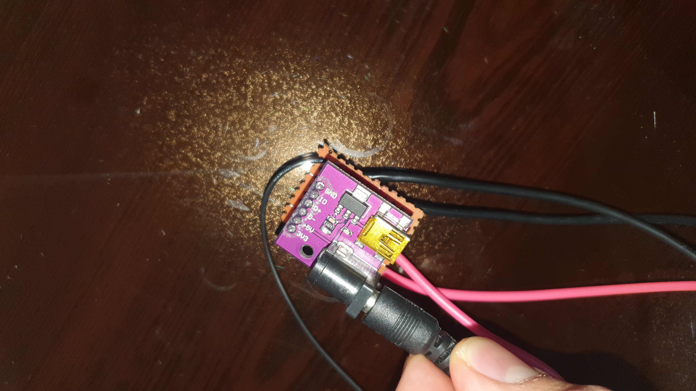
</p>

The power section was prototyped separately to handle the power input and distribution required by the system.

After validating the design through the breadboard and perfboard prototypes, the system was moved to custom-designed PCBs.

### Prototype Demonstration

The perfboard prototype was tested with the actual pump-control circuitry and soil-moisture sensors. The following video shows the prototype reading soil-moisture data and controlling the pumps.

[Watch the perfboard prototype demonstration](docs/video/perf-demo.mp4)

### Custom PCBs

The final prototype uses two custom-designed PCBs: a logic PCB and a power PCB.
The boards were designed specifically for AGW to integrate the ESP32, sensor interfaces, pump control circuitry, and power distribution into a compact system.

<table>
  <tr>
    <td>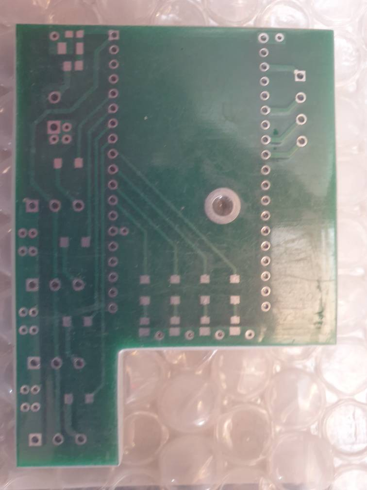</td>
    <td>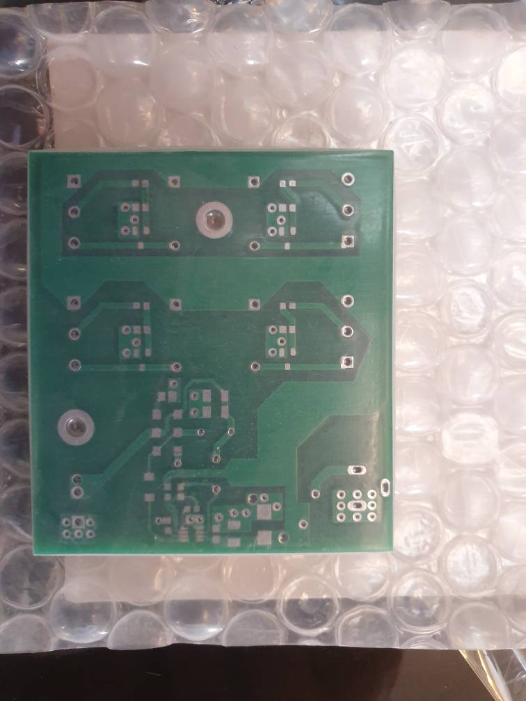</td>
  </tr>
  <tr>
    <td align="center">Logic PCB</td>
    <td align="center">Power PCB</td>
  </tr>
</table>


## CAD & Enclosure Design

The enclosure was designed in SolidWorks to house the two custom PCBs while providing appropriate mounting, cable routing, and physical separation between the control and power sections.

### Enclosure Design

<p align="center">
  
</p>

The enclosure was designed around the dimensions and layout of the custom PCBs. It includes internal mounting features, cable-gland openings, PCB mounting points, and a divider separating the control and power sections.

### Assembly

<p align="center">
  
</p>

The SolidWorks assembly was used to verify the placement of the PCBs, connectors, cable routing, and other components before manufacturing the enclosure.

A transparent view was also used during the design process to inspect the internal arrangement and verify component clearances.
The enclosure was designed around the actual PCB dimensions and connector locations, allowing the electronics to be assembled into a compact, serviceable enclosure.

<p align="center">
  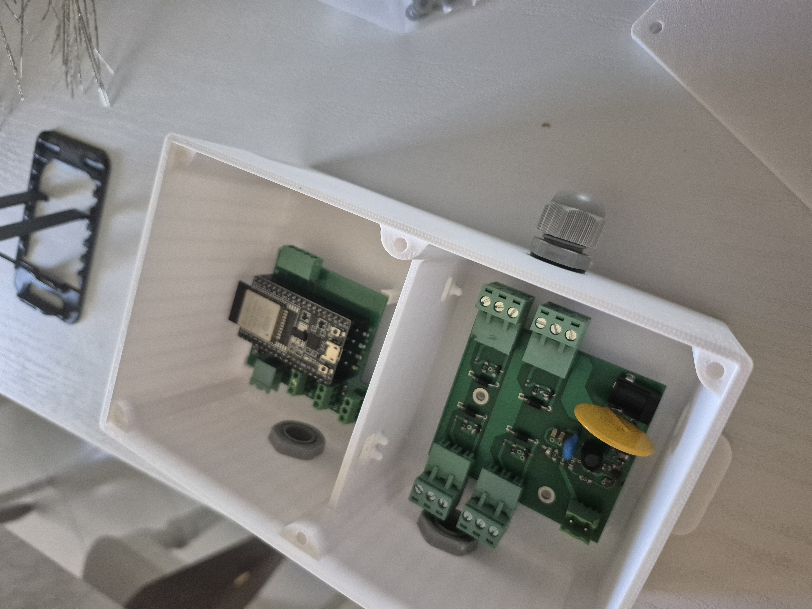
</p>

### 3D-Printed Enclosure

<p align="center">
  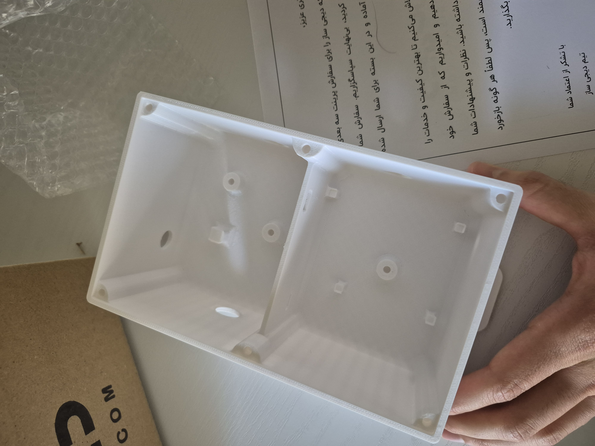
  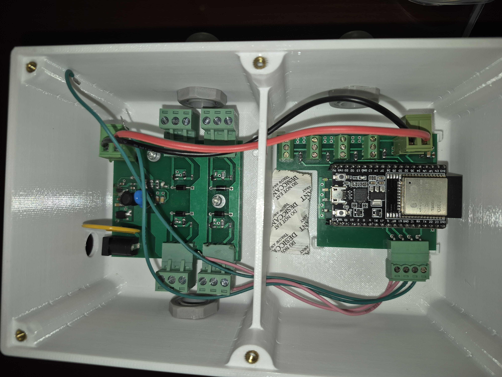
</p>

The final enclosure was 3D printed and assembled with the custom PCBs. The design provides dedicated mounting locations for the electronics while allowing external connections to pass through cable glands mounted on the enclosure walls.

## Testing & Deployment

The system was tested incrementally throughout development, beginning with basic ESP32 communication and progressing to the complete watering system.

### Communication Testing

The breadboard prototype was used to verify communication between the ESP32 and the Flask backend. LEDs were initially used as simulated pump outputs before the actual pumps were integrated.

### Hardware Testing

The perfboard prototype was tested with the actual pump-control circuitry and soil-moisture sensors. This allowed the sensor data acquisition and pump-control functionality to be verified before moving to the custom PCBs.

### Garden Deployment

The completed system was installed in the garden and connected to the actual watering setup, including the water pumps and irrigation hoses.

The deployed system is capable of successfully reading soil-moisture data and controls the pumps through the web application, demonstrating the complete communication and control chain from the user interface to the physical watering system.

## Project Status

The core AGW system is functional, including the ESP32 firmware, custom PCBs, pump control, backend, and web application.

The system has been deployed in the garden and tested with the actual watering setup, including the pumps and irrigation hoses.

Soil-moisture sensing hardware and firmware support have been implemented and tested on the prototype, but the sensors were not installed in the final garden deployment because sufficiently long cables were not available due to a sharp increase in cable prices.

The system currently operates within the local network. Remote access outside the local network is planned as a future improvement.

## Security & Configuration

Credentials, authentication secrets, local configuration files, and generated databases are intentionally excluded from the repository.

Before running the system, the required configuration files must be created locally according to the deployment environment.

## Repository Structure

```text
AGW-GitHub/
├── AGW/                    # ESP32 firmware
│   ├── include/
│   ├── src/
│   ├── test/
│   └── platformio.ini
│
├── AGW_web/                # Flask web application
│   ├── static/
│   ├── templates/
│   ├── main.py
│   └── requirements.txt
│
├── docs/
│   ├── images/             # Project images
│   └── video/              # Demonstration video
│
├── README.md
└── .gitignore
```